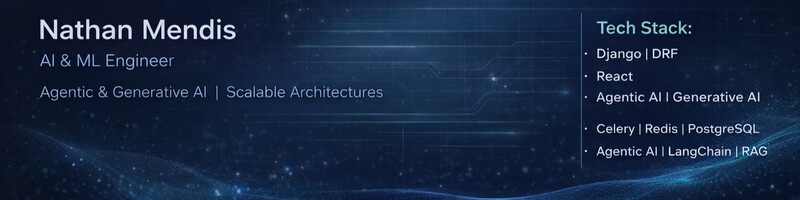

# Hey 👋 I'm Nathan Mendis

### Backend-Focused Software Engineer • AI Systems • Scalable Architectures

---

##  About Me

- 🌍 Based in Pune, India
- 🧠 Building AI-powered systems & scalable backend architectures
- 🚀 Currently working on **Harvey — AI HR Agent**
- ⚡ Learning **Spring Boot, Agentic AI & Distributed Systems**
- 🤝 Open to collaborating on ambitious projects
- ☕ Can survive on caffeine and Docker logs
- ⚡ Fun fact: I still say *"this should work"* before breaking production

---

#  Tech Stack

---

# GitHub Stats

---

# Connect With Me

---

### 🚀 Building scalable systems, experimenting with AI agents, and occasionally fighting semicolons.

